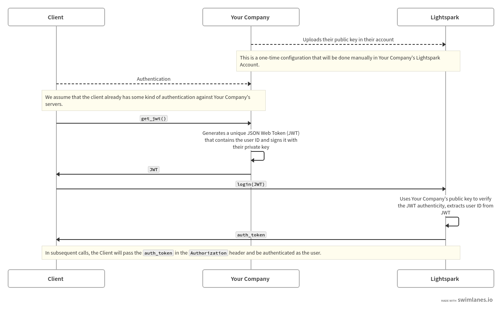
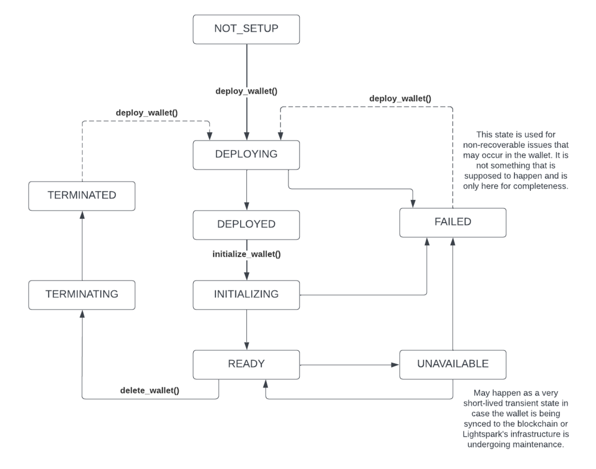

# Module wallet-sdk

## Lightspark Kotlin Wallet SDK 🤖


This is a Kotlin (multiplatform) Wallet SDK for the Lightspark API. It can be used from an Android
environment to integrate with a Lightspark Lightning wallet.

**NOTE:** This SDK is still in beta and is subject to change.

[API Reference](https://app.lightspark.com/docs/reference/kotlin/wallet-sdk/index.html)

### Getting started

Start by installing the SDK from maven:

**build.gradle:**

```groovy
  dependencies {
    implementation "com.lightspark:wallet-sdk:0.3.0"
  }
```

or with **build.gradle.kts:**

```kotlin
  dependencies {
    implementation("com.lightspark:wallet-sdk:0.3.0")
  }
```

To use the SDK, you'll need to create a client instance. The SDK offers several client
implementations which are suitable for different environments and needs:

- `LightsparkCoroutinesWalletClient` - A client which uses the `kotlinx.coroutines` library to make
  asynchronous API calls. This is the recommended client for Android and other environments using
  Kotlin.
- `LightsparkSyncWalletClient` - A fully synchronous client implementation which can be used to make
  blocking calls in an environment where you want more control over your concurrency model.
- `LightsparkFuturesWalletClient` - A client which returns `java.util.concurrent.CompletableFuture`
  results for asynchronous API calls. This is the recommended client for Java environments using JDK
  8+.

To initialize a client, you'll need to use the `ClientConfig` object.

```kotlin
// Initialize a new client:
val lightsparkClient = LightsparkCoroutinesWalletClient(ClientConfig())

// Log in using a custom JWT login (see Authentication section below):
val loginResults = lightsparkClient.loginWithJWT(
    "your-account-id",
    "your-jwt-token",
    SharedPrefsJwtStorage(applicationContext)
)
Log.d("Lightspark", "Current wallet info: ${loginResults.wallet}")

// An example API call fetching the dashboard info for the active wallet:
val dashboard = lightsparkClient.getWalletDashboard()
```

or in Java using the synchronous client:

```java
// Initialize the client with account token info:
LightsparkSyncClient lightsparkClient = new LightsparkSyncClient(new ClientConfig());

// Log in using a custom JWT login (see Authentication section below):
LoginWithJWTOutput loginResults = lightsparkClient.loginWithJWT(
        "your-account-id",
        "your-jwt-token",
        new SharedPrefsJwtStorage(applicationContext)
);
Log.d("Lightspark", "Current wallet info: " + loginResults.wallet.toString());

// An example API call fetching the dashboard info for the active wallet:
WalletDashboard dashboard = lightsparkClient.getWalletDashboard();
```

or in Java using the Futures client:

```java
LightsparkFuturesClient lightsparkClient = new LightsparkFuturesClient(new ClientConfig());

// Log in using a custom JWT login (see Authentication section below):
LoginWithJWTOutput loginResults = lightsparkClient.loginWithJWT(
        "your-account-id",
        "your-jwt-token",
        new SharedPrefsJwtStorage(applicationContext)
);
Log.d("Lightspark", "Current wallet info: " + loginResults.wallet.toString());

// An example API call fetching the dashboard info for the active wallet:
WalletDashboard dashboard = lightsparkClient.getWalletDashboard().get(5, TimeUnit.SECONDS);
```

### Authentication via JWT

The current version of the SDK supports JWT authentication, which is intended for client-side use.
To authenticate, you'll need to login using your Lightspark account ID and
a JWT allocated for the user by your own server.



First, you'll need to register your account public key with Lightspark. You can do this from
the [Lightspark account settings page](https://app.lightspark.com/https://app.lightspark.com/account#security).
You'll need to provide the public key for the account you want to use to sign JWTs. You can generate a keypair using
the _ES256_ algorithm using the following command:

```bash
openssl genrsa -out private.key 2048
```

This will generate a private key file called private.key. You can then generate the public key file
using the following command:

```bash
openssl rsa -in private.key -pubout -out public.key
```

You can then copy the contents of the public key file into the "JWT Public Key" field on the API
Tokens page. You'll also want to copy the private key into your server code (or rather in secret
keystore or environment variable), so that you can use it to sign JWTs.

Next, you'll need to create a JWT for the user. You should expose an endpoint from your backend to
create these tokens. For example, to create a JWT from a typescript+node server:

```typescript
import * as jwt from "jsonwebtoken";

// Create a JSON object that contains the claims for your JWT.
const claims = {
  aud: "https://api.lightspark.com",
  // Any unique identifier for the user.
  sub: "511c7eb8-9afe-4f69-989a-8d1113a33f3d",
  // True to use the test environment, false to use the production environment.
  test: true,
  iat: 1516239022,
  // Expriation time for the JWT.
  exp: 1799393363,
};

// Call the `sign()` method on the `jsonwebtoken` library, passing in the JSON object and your private key.
const token = jwt.sign(claims, "your private key");

// Now send the token back to the client so that they can use it to authenticate with the Lightspark SDK.
```

Now on the client, you can login using the JWT and your company's account ID from the account settings page:

```kotlin
client.loginWithJWT(ACCOUNT_ID, jwt, SharedPrefsJwtStorage(applicationContext))
```

You'll notice that this request takes a parameter which is an implementation of JwtStorage. This can
be used to save credentials for the next time the app starts up. If you want to recover wallet
credentials using saved JWT info, you can pass a JWT storage implementation to the client
constructor. For example, if you've previously logged in using a `SharedPrefsJwtStorage`
implementation, you can recover the credentials at app startup like so:

```kotlin
val jwtStorage = SharedPrefsJwtStorage(applicationContext)
val client = LightsparkCoroutinesWalletClient(ClientConfig(authProvider = CustomJwtAuthProvider(jwtStorage)))
```

### Deploying and initializing a wallet



When a user logs in for the first time, initially, their wallet will be in a `NOT_SETUP` status. You
can identify this status by querying the current wallet:

```kotlin
val wallet = client.getCurrentWallet()
if (wallet.status == WalletStatus.NOT_SETUP) {
    // The wallet is not setup, so we need to deploy it.
}
```

To deploy the wallet, you'll need to call `client.deployWallet()` and then wait for the wallet's
status to update to the DEPLOYED or FAILED status. You can do this either by polling the wallet, or
by using convenient helper methods:

```kotlin
// In a coroutine:
client.deployWalletAndAwaitDeployed().collect {
    Log.d("Lightspark", "Wallet status: ${it.status}")
}

// Now the wallet is either DEPLOYED or FAILED.
```

Once the wallet is deployed, you can initialize it. However, first you'll need signing keys for the
wallet to complete sensitive operations.

#### Key generation for the wallet

When initializing the wallet, you'll need to provide a public key for the wallet to use to sign
transactions. Note that this _is not_ the same as your JWT signing key used above. It should be
unique to each user's wallet. It is the responsibility of your application to safely store the
keypair for the user. Losing the private key will result in the user losing access to their wallet.
Currently, the wallet SDK only supports RSA-PSS keys, but we plan to support other key types in the
future.

For convenience, the wallet SDK provides a `generateSigningKeyPair()` method which can be used to
generate a keypair. You can then store the keys however you'd like in your application code.
Alternatively, on Android, you can also use the `generateSigningKeyPairInAndroidKeyStore` method
which will directly create the signing key in the AndroidKeyStore, which is a secure storage
mechanism for keys on Android. Note that this method will not give you access to the raw key
material.

```kotlin
val keyPair = generateSigningKeyPair()
val signingWalletPublicKey = keyPair.public.encoded
val signingWalletPrivateKey = keyPair.private.encoded

// Store the keys somewhere safe.
```

#### Initializing the wallet

Now that you've got keys, you can initialize the wallet! Just like when deploying, you can do this
either by polling the wallet, or by using Flow helpers:

```kotlin
val wallet = client.initializeWalletAndWaitForInitialized(
    keyType = KeyType.RSA_OAEP,
    signingPublicKey = Base64.encodeToString(sigingWalletPublicKey, Base64.NO_WRAP),
    signingPrivateKey = Base64.encodeToString(sigingWalletPrivateKey, Base64.NO_WRAP)
).collect {
    Log.d("Lightspark", "Wallet status: ${it.status}")
}

// Now the wallet is either READY or FAILED.
```

#### Unlock the wallet and make requests

When the wallet is in the READY state, you can make requests. However, in order to complete
sensitive operations like sending payments, first you'll need to unlock the wallet using the private
key you generated earlier.

```kotlin
client.loadWalletSigningKey(Base64.encodeToString(sigingWalletPrivateKey, Base64.NO_WRAP))
```

Alternatively, if you created the key in the AndroidKeyStore
via `generateSigningKeyPairInAndroidKeyStore`, you'll need to load the key via its alias you
assigned at creation:

```kotlin
walletClient.loadWalletSigningKeyAlias(LIGHTSPARK_SIGNING_KEY_ALIAS)
```

Now you can make requests! For example, to create an invoice:

```kotlin
val invoiceData = client.createInvoice(
    amountMsats = 100_000,
    memo = "mmmmm pizza",
)
```

or pay an invoice:

```kotlin
val payment = client.payInvoice(
    encodedInvoice = invoiceData.encodedPaymentRequest,
    maxFeesMsats = 50_000,
)
```

For more examples, check out
the [E2E test suite](./src/androidUnitTest/kotlin/com/lightspark/sdk/wallet/ClientIntegrationTests.kt)
or the [sample app](../androidwalletdemo/README.md).

### Building and running the sample app

You can build the SDK and sample app using Gradle or Android Studio. The easiest option is to open
this root directory as a project in Android studio and run the `androidwalletdemo` app configuration
on an Android device or emulator.
